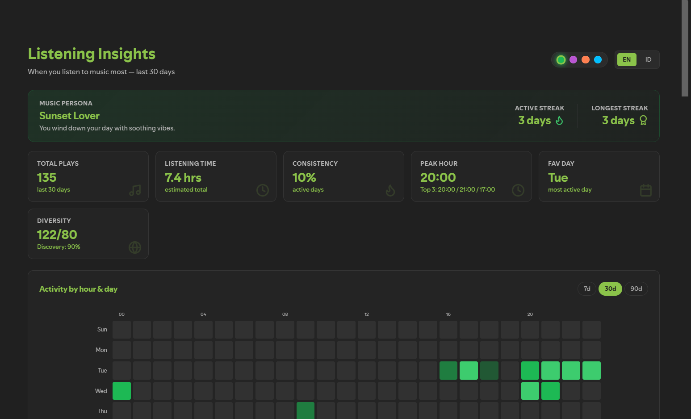
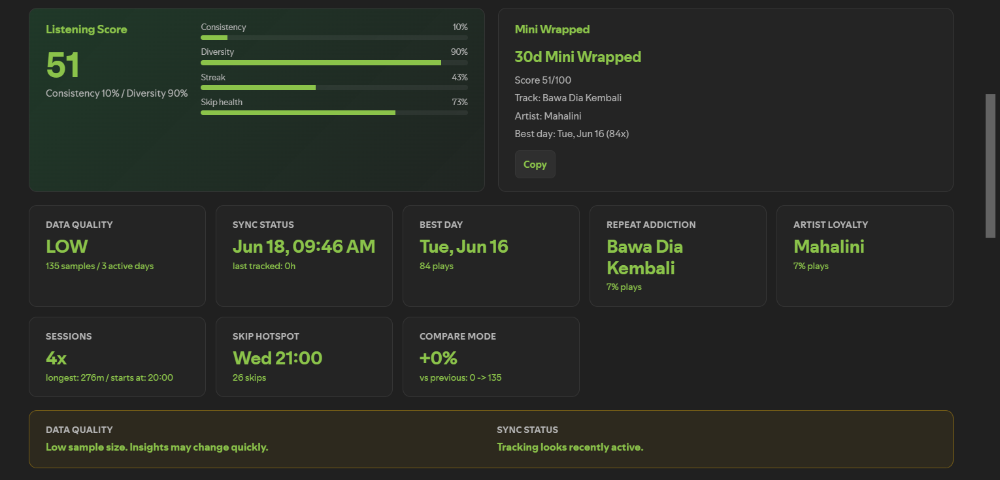

# 📊 Listening Insights for Spicetify

A gorgeous, premium dashboard for Spotify Desktop that turns your playback history into beautiful, actionable listening insights. Track your musical habits, monitor streaks, compare periods, back up local data, and see when you listen to music most with interactive heatmap grids.




## ✨ Features

- **Interactive Heatmap Grid**: Visualize your daily activity by hour and day of the week. Hover over cells to see exact counts.
- **Tabbed Dashboard Layout**: Keeps the main app focused with Overview, Patterns, Library, and Data sections.
- **Listening Coach**: Local pattern intelligence that highlights activity shifts, repeat habits, skip hotspots, discovery gaps, and next listening actions.
- **Consolidated Insights**:
  - **Active Time**: Detects which period of the day (Morning, Afternoon, Evening, Night) you listen to music most.
  - **Music Persona**: Dynamic personality mapping based on your busiest playback times.
  - **Streak Tracker**: Tracks your active consecutive listening days and all-time best streaks.
  - **Skip Rate Analyzer**: Detects how selective you are with an anti-skip filter (fair-play filter that only registers songs played for 20+ seconds).
- **Top Tracks & Artists**: Beautiful charts displaying your top played tracks and artists with direct playback controls, dynamic cover fetches, and circular avatars.
- **Track & Artist Trend Arrows**: Shows rank movement, new entries, and play-count deltas compared with the previous period.
- **Library Trend Charts**: Recharts-powered rank movement charts for top tracks and artists with period-over-period deltas.
- **Monthly Recap**: See this month's plays, top track, top artist, peak hour, and unique songs at a glance.
- **Listening Goals**: Track active streak, monthly play target, and discovery rate progress.
- **Genre Insights**: Fetches Spotify artist genre metadata to show what styles dominate your listening.
- **Listening Heatmap**: Daily contribution-style heatmap for the selected period, making active and quiet days easy to spot.
- **Smart Recommendations**: Suggests Spotify searches based on your peak listening time, top artists, and discovery habits.
- **Advanced Taste Signals**: Listening score, best listening day, repeat addiction, artist loyalty, session detection, skip hotspots, period comparison, active-time trend, mini wrapped, listening coach, and current taste hints.
- **Data Quality & Sync Notices**: Shows when insights have low sample size and when tracking may have gaps because Spotify Desktop was closed.
- **Backup & Data Manager**: Export/import local data, inspect storage usage, and clear skip data without wiping play history.
- **Bilingual Support**: Instant toggle between English and Indonesian.
- **100% Local & Private**: All data is stored securely in your local browser storage.

## 🚀 Installation

### Option 1: Via Spicetify Marketplace (Recommended)
1. Open Spotify Desktop.
2. Go to the **Marketplace** page from the sidebar.
3. Search for **Listening Insights**.
4. Click **Install**.

---

### Option 2: Manual Installation
Clone this repository directly into your Spicetify `CustomApps` directory:

#### Windows (PowerShell)
```powershell
cd "$env:APPDATA\spicetify\CustomApps"
git clone https://github.com/AnggaaIs/spotify-heatmap.git listening-insights
spicetify config custom_apps listening-insights
spicetify apply
```

#### macOS / Linux (Terminal)
```bash
cd ~/.config/spicetify/CustomApps
git clone https://github.com/AnggaaIs/spotify-heatmap.git listening-insights
spicetify config custom_apps listening-insights
spicetify apply
```

---

## 🛠️ Development

If you want to customize or build the extension from source:

1. Clone the repository:
   ```bash
   git clone https://github.com/AnggaaIs/spotify-heatmap.git
   cd spotify-heatmap
   ```
2. Install dependencies:
   ```bash
   pnpm install
   ```
3. Install local Git hooks:
   ```bash
   pnpm hooks:install
   ```
4. Run compiler in development mode:
   ```bash
   pnpm watch
   ```
5. Build minified files for production:
   ```bash
   pnpm build-local
   ```

Package/app id: `listening-insights`.

### Source structure

- `src/components/HeatmapPage.tsx`: small dashboard orchestrator.
- `src/hooks/useListeningDashboard.ts`: local dashboard state and refresh lifecycle.
- `src/components/tabs/`: tab-level UI sections.
- `src/components/panels/`: reusable analytics panels.
- `src/components/advanced/`: advanced insight copy and shared UI helpers.
- `src/analytics/`: higher-value analytics modules such as Listening Coach.

## 📦 Release Notes
See [CHANGELOG.md](CHANGELOG.md) for version history.

## 🌿 Branching & CI
See [BRANCHING.md](BRANCHING.md) for the release branch strategy. GitHub Actions validate typecheck, release metadata, and production builds on pull requests and tags.

Tagged releases also publish a generated `dist` branch for Spicetify Marketplace discovery.

## ⚖️ License
MIT License. Open-source and free to use.
